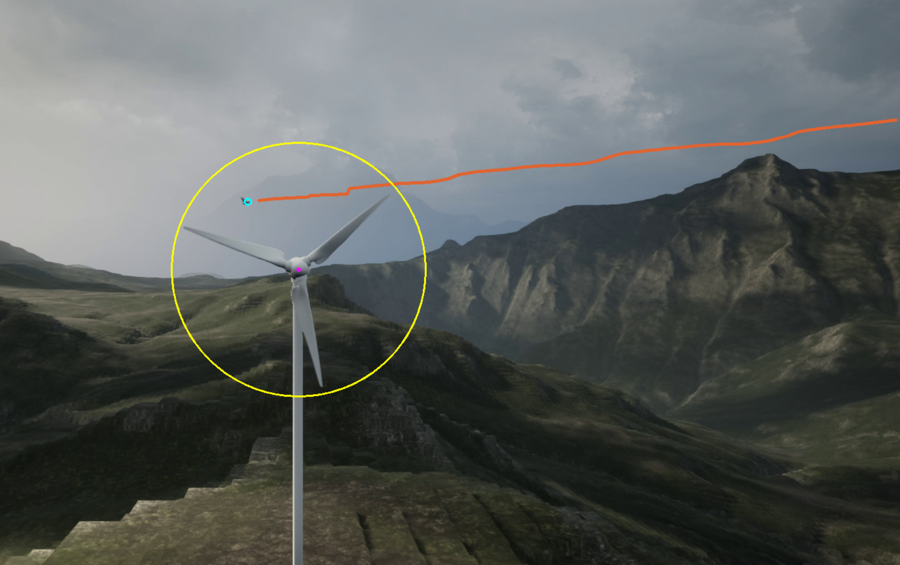

# Windrad-Vogeltracking

Dieses Projekt beschäftigt sich mit der Erkennung von Wildvögeln im Umkreis von Windkraftanlagen,
um diese zu tracken, und eine mögliche Kollision mit der Anlage zu prognostizieren.

Die Erkennung basiert auf einfacher Bildverarbeitung.
Für die Erkennung wurden Videos aus der Unreal Engine herausgerendert, mit denen das Programm getestet werden kann.
Um die Windkraftanlage herum werden im 90° Winkel zwei Kameras platziert, aus den Videos beider Kameras werden jeweils
durch Motiondetection alle bewegten Objekte detektiert, und dann versucht sie von den sich bewegenden Windradrotoren
zu unterscheiden.

Die Rotoren werden maskiert, und die restlichen bewegten Objekte getrackt.
Aus der überlagerung beider Bilder können dann 3D Koordinaten der Vögel abgeleitet undzukünftige Flugbahnen
geschätzt werden.